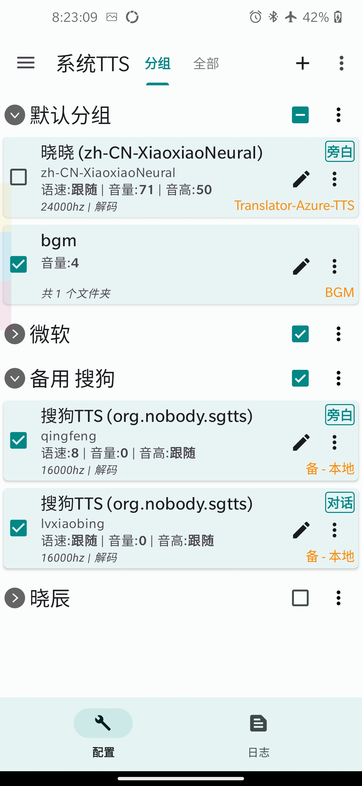
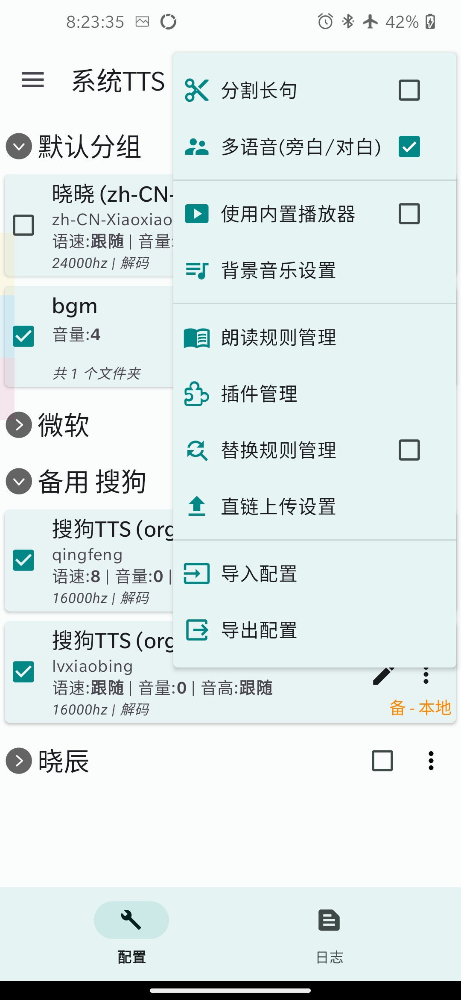
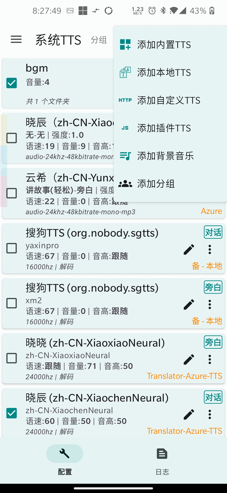
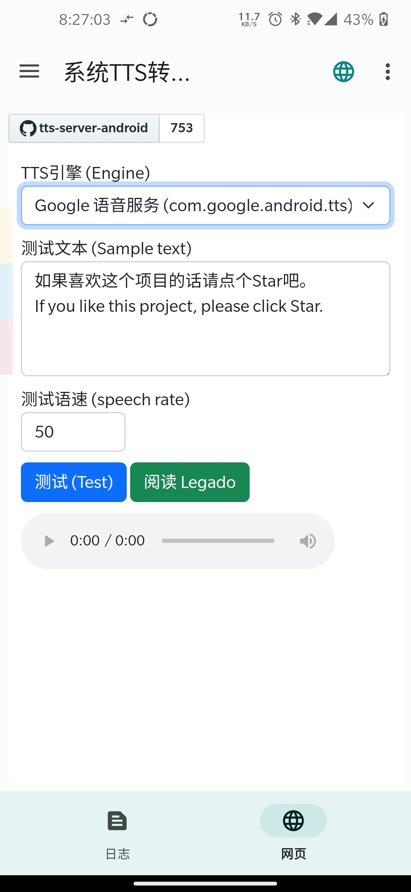

# TTS Server 

本APP起初为阅读APP的网络朗读所用，在原有基础上，现已支持:

* 内置微软接口(Edge大声朗读、~~Azure演示API~~(已猝) )，可自定义HTTP请求，可导入其他本地TTS引擎，以及根据中文双引号的简单旁白/对话识别朗读
  ，还有自动重试，备用配置，文本替换等更多功能。

  
点击展开查看截图

  
  
  
  

# Download

* [Stable - 稳定版(Releases)](https://github.com/jing332/tts-server-android/releases)

* [Dev - 开发版(Actions 需登陆Github账户)](https://github.com/jing332/tts-server-android/actions)

# JS
#### 朗读规则
程序已内置旁白对话规则，通过 朗读规则管理 -> 加号 添加。

由用户制作的朗读规则：
1. 可识别角色名的旁白对话规则：
打开[此链接](https://www.gitlink.org.cn/geek/src/tree/master/ttsrv-speechRules-multiVoice.json), 复制全部内容到剪贴板，然后在规则管理界面导入。

2. 5种语言检测： 复制 [此链接](https://jt12.de/SYV2_1/2023/04/16/10/08/08/1681610888643b588876c09.json), 规则管理界面选择网络链接导入。

#### TTS插件
程序已内置Azure官方接口的TTS插件: 插件管理 -> 右上角添加 -> 保存 -> 设置变量 -> 填入Key与Region即可

讯飞WebAPI插件：复制 [此链接](https://jt12.de/SYV2_1/2023/04/16/10/25/17/1681611917643b5c8d61313.json), 插件管理界面选择网络链接导入，随后设置变量 AppId, ApiKey, ApiSecret即可。

# Grateful

  
开源项目

| Android Application                                                             | Microsoft TTS                                                         |
|---------------------------------------------------------------------------------|-----------------------------------------------------------------------|
| [gedoor/legado](https://github.com/gedoor/legado)                               | [wxxxcxx/ms-ra-forwarder](https://github.com/wxxxcxx/ms-ra-forwarder) |
| [ag2s20150909/TTS](https://github.com/ag2s20150909/TTS)                         | [litcc/tts-server](https://github.com/litcc/tts-server)               |
| [benjaminwan/ChineseTtsTflite](https://github.com/benjaminwan/ChineseTtsTflite) | [asters1/tts](https://github.com/asters1/tts)                         |
| [yellowgreatsun/MXTtsEngine](https://github.com/yellowgreatsun/MXTtsEngine)     |
| [2dust/v2rayNG](https://github.com/2dust/v2rayNG)                               |

| Android Library                                                                                   | Description                                                                 |
|---------------------------------------------------------------------------------------------------|-----------------------------------------------------------------------------|
| [Rosemoe/sora-editor](https://github.com/Rosemoe/sora-editor)                                     | sora-editor is a cool and optimized code editor on Android platform         |
| [gedoor/rhino-android](https://github.com/gedoor/rhino-android)                                   | Give access to RhinoScriptEngine from the JSR223 interfaces on Android JRE. |
| [liangjingkanji/BRV](https://github.com/liangjingkanji/BRV)                                       | Android上最好的RecyclerView框架, 比 BRVAH 更简单强大                                    |
| [liangjingkanji/Net](https://github.com/liangjingkanji/Net)                                       | Android最好的网络请求工具, 比 Retrofit/OkGo 更简单易用                                     |
| [chibatching/kotpref](https://github.com/chibatching/kotpref)                                     | Android SharedPreferences delegation library for Kotlin                     |
| [google/ExoPlayer](https://github.com/google/ExoPlayer)                                           | An extensible media player for Android                                      |
| [material-components-android](https://github.com/material-components/material-components-android) | Modular and customizable Material Design UI components for Android          |
| [kotlinx.serialization](https://github.com/Kotlin/kotlinx.serialization/)                         | Kotlin multiplatform / multi-format serialization                           |
| [kotlinx.coroutine](https://github.com/Kotlin/kotlinx.coroutines)                                 | Library support for Kotlin coroutines                                       |

其他资源：

* [阿里巴巴IconFont](https://www.iconfont.cn/)

* [酷安@沉默_9520](http://www.coolapk.com/u/25956307) 本APP图标作者
