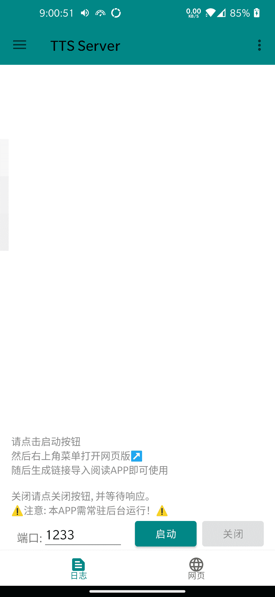
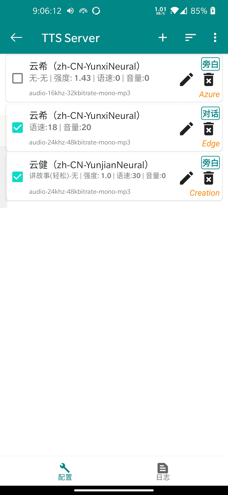

# TTS Server
本APP起初为阅读APP的网络朗读所用，在原有基础上，现已支持系统TTS，并可以自定义HttpTTS。

这是 [tts-server-go](https://github.com/jing332/tts-server-go) 的Android版本。使用Kotlin开发，通过 [Gomobile](https://pkg.go.dev/golang.org/x/mobile/cmd/gomobile) 将Go编译为Lib以供Android APP调用. 关于本项目的Go Lib,见 [tts-server-lib](./tts-server-lib).

  
点击展开查看截图

  
> 左图为服务转发日志界面，用于阅读APP的网络朗读。 
右图为系统TTS配置界面，可被使用系统TTS的APP调用。

  
  
  

# Download

[稳定版(Release)](https://github.com/jing332/tts-server-android/relaease) |
[开发版(Action)](https://github.com/jing332/tts-server-android/actions)

# Grateful

开源项目：
|  Android APP   | 微软TTS实现  |
|  ----  | ----  |
| [gedoor/legado](https://github.com/gedoor/legado)        | [wxxxcxx/ms-ra-forwarder](https://github.com/wxxxcxx/ms-ra-forwarder) |
| [ag2s20150909/TTS](https://github.com/ag2s20150909/TTS)  | [litcc/tts-server](https://github.com/litcc/tts-server) |
| [benjaminwan/ChineseTtsTflite](https://github.com/benjaminwan/ChineseTtsTflite)| [asters1/tts](https://github.com/asters1/tts) |
| [2dust/v2rayNG](https://github.com/2dust/v2rayNG) |

| Android 库| 介绍 |
| ----      | ---- |
| [liangjingkanji/BRV](https://github.com/liangjingkanji/BRV) | Android上最好的RecyclerView框架, 比 BRVAH 更简单强大 |
| [liangjingkanji/Net](https://github.com/liangjingkanji/Net) | Android最好的网络请求工具, 比 Retrofit/OkGo 更简单易用 |
| [chibatching/kotpref](https://github.com/chibatching/kotpref) |  Android SharedPreferences delegation library for Kotlin |
| [google/ExoPlayer](https://github.com/google/ExoPlayer) | An extensible media player for Android |
| [material-components-android](https://github.com/material-components/material-components-android) | Modular and customizable Material Design UI components for Android |
| [kotlinx.serialization](https://github.com/Kotlin/kotlinx.serialization/) | Kotlin multiplatform / multi-format serialization |
| [kotlinx.coroutine](https://github.com/Kotlin/kotlinx.coroutines) | Library support for Kotlin coroutines |

其他资源：
* [阿里巴巴Iconfont](https://www.iconfont.cn/)
 
* [酷安@沉默_9527](https://www.coolapk.com/u/230844) 本APP图标作者
